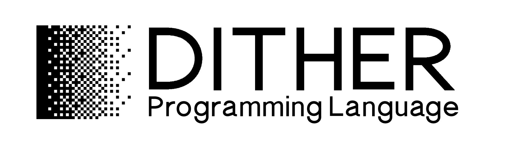
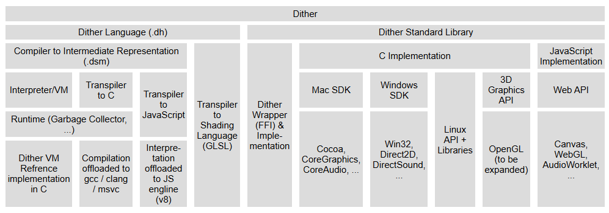

**[Website](https://dither-lang.netlify.app) | [Online Editor](https://dither-lang.netlify.app/editor.html) | [Blocks Editor](https://dither-lang.netlify.app/blocks.html) | [Syntax](SYNTAX.md) | [Examples](examples) | [Download](https://github.com/LingDong-/dither-lang/releases)**

> 🚧 Currently, Dither is under active development. While it is already quite usable and many programs have been created in it, there're still components that are not fully working yet. However, you're more than welcome to give it a try! Any feedback is greatly appreciated. 🚧

Dither is a programming language for creative coding. 

- **Compiled or interpreted: your choice.** Use interpreted mode for fast iteration, and compile your code when you're done for fast execution.

- **CPU and GPU, web or native: write once.** Dither code can be directly compiled to shaders. Dither and its standard libraries runs natively on windows, mac, linux and the web.

- **Automatic inference of variable types.** The merits of a typed-system without the hassle of writing them.

- **Vector math, built-in.** Vector and matrix operations are integrated into the syntax of Dither.

- **Pixels-oriented.** Standard libraries focused on getting pixels onto your screen (or sound to your speakers), ASAP.

For more information and learning resources, check out the [Dither website](https://dither-lang.netlify.app).

On how to work with the Dither source code, check out the [development documentation](DEVELOPMENT.md).

## Quick Start

The easiest way to try Dither is with the [online editor](https://dither-lang.netlify.app/editor.html). 

[](https://dither-lang.netlify.app/editor.html)

### Build
- macOS / Linux:  
>./build.sh  
>./build.sh dbg=1
- Windows (MSVC):  
>build.bat  
>build.bat dbg=1

You can also [download](https://github.com/LingDong-/dither-lang/releases) the stand-alone single-binary commandline tool for windows, mac or linux.

```
usage:
    dither [options] file.dh
options:
    --target,  -t name : compile backend: vm/c/js/html
    --output,  -o path : output path
    --execute, -x      : execute generated code
    --include, -I path : add include path
    --command, -c cmd  : program passed in as string
    --inter,   -i      : interactive shell (repl)
    --help,    -h      : print this help
    --version, -V      : print version
```

### Typical usage

Run a program in interpreted mode:

```
dither -x examples/helloworld.dh
```

Compile a program to C and run it (requires system C compiler gcc/clang/msvc):

```
dither -xvt c examples/helloworld.dh
```

Compile a program to JavaScript, and host a local server to run it:

```
dither -xvt html examples/tree.dh
```

Enter interactive shell:

```
dither -i
```

Then follow the [syntax guide](SYNTAX.md) or start from one of the [examples](examples). **You can also check out [what the author is creating](https://github.com/LingDong-/dither-sketches) with Dither.**


## How Dither Works



When you write a program in Dither, it is first translated into an lower-level representation which then either gets translated again to C or JavaScript (compiled mode) or run directly by the Dither VM (interpreted mode).

The Dither standard library maps hardware and system-related (such as graphics and sound) components to native API's on each operating system, exposing them to a Dither interface (with some higher level functionalities implemented directly in Dither).
